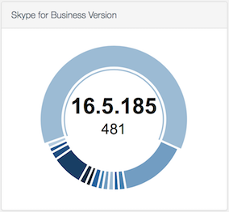

# sal_plugins
This repository contains Sal dashboard plugins for tracking Microsoft Office, OneDrive, and Skype for Business versions. Code modified from sep_version plugin written by [Shea Craig](https://github.com/sheagcraig/sheagcraig_sal_plugins).

## Plugins
### Microsoft Office

The Microsoft Office plugin tracks the installed version of Microsoft Outlook specifically. All Office applications are likely to be updated in sync, so we track one application version rather than versions for each Office product.

### Microsoft OneDrive

### Skype for Business

## How to Modify Plugins for Use with Other Applications
These plugins can easily be modified to track version numbers for any application of interest. To do so, you must modify the `application__name` and `inventoryitem__application__name` values in *application*_version.py to reflect the name of the application you wish to track. Ensure that this name matches the name of the application's .app file. Class names, plugin names, descriptions, and file names should also be updated appropriately.